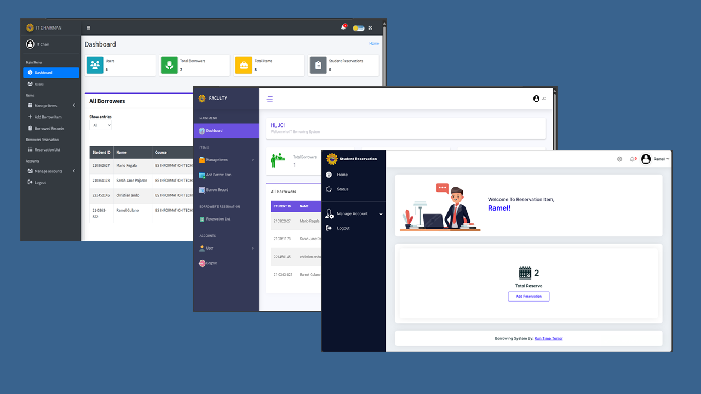

## Table of contents

- [Overview](#overview)
  - [Screenshot](#screenshot)
  - [Links](#links)
- [My process](#my-process)
  - [Built with](#built-with)
  - [What I learned](#what-i-learned)

## Overview

This system enables IT faculty to manage item borrowing, returning, and monitoring, while also allowing borrowers to reserve items in advance and ensure timely returns. The system aims to address the challenges of the current manual borrowing process, which is slow, prone to errors, and reliant on paper documentation. By introducing a web-based platform, the project seeks to streamline borrowing procedures, enhance efficiency, reduce errors, and improve data accuracy for both the IT faculty and borrowers.

### Screenshot

### Links

- Solution URL: [View Code](https://github.com/Ramelzkie96/pixify-image.git)
- Live Site URL: [Live Site](https://borrowingitem.pythonanywhere.com/login/)

## My Process

### 🛠 Built With

- **Frontend**:  
  - HTML  
  - CSS  
  - JavaScript  
  - jQuery  
  - AJAX  

- **Styling & UI**:  
  - Bootstrap  
  - Custom Fonts  

- **Backend**:  
  - Django (Python Web Framework)

- **Database**:  
  - MySQL *(Can be switched to SQLite for portability)*

---

### 📚 What I Learned

- Implementing multi-role authentication and session-based user tracking.
- Building efficient, user-friendly search functionality with jQuery and AJAX.
- Integrating Django email backend for automatic notifications.
- Handling dynamic form population based on database entries.
- Packaging Django projects into standalone `.exe` apps using PyInstaller.

